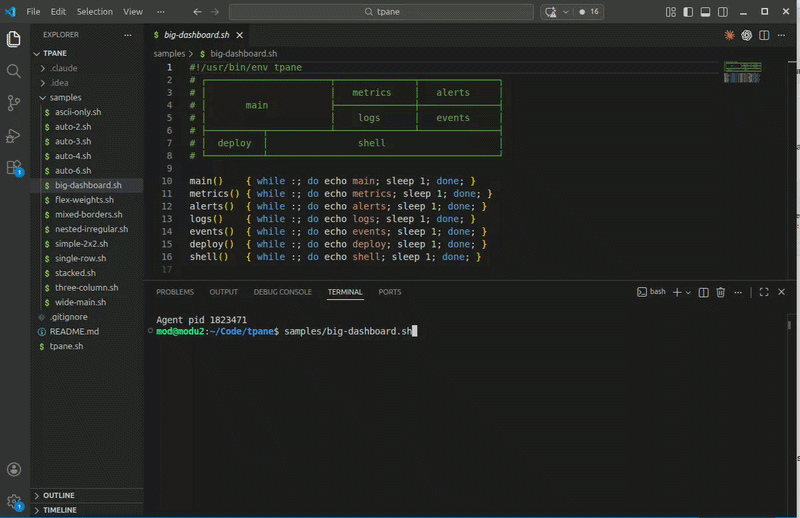

# tpane

**Draw your tmux layout in comments. Run it like a script.**

```bash
#!/usr/bin/env tpane
# ┌──────────────────────┬──────────────────────┐
# │        api           │        worker        │
# │                      ├──────────────┬───────┤
# │                      │    queue     │ logs  │
# ├──────────────────────┼──────────────┴───────┤
# │       frontend       │        shell         │
# └──────────────────────┴──────────────────────┘

api()      { python3 api.py; }
worker()   { python3 worker.py; }
queue()    { redis-cli monitor; }
logs()     { tail -f app.log; }
frontend() { npm run dev; }
shell()    { bash; }
```

```bash
./dev.sh
```

That's it.
> Hint: **"Column Selection Mode"** is your friend


---
### Doing a simple shape?
No need for a diagram. `tpane` will auot-layout for you (1-3 functions => single row, 4 => 2x2, 6 => 2x3)
```bash
#!/usr/bin/env tpane
api()      { while :; do echo api; sleep 1; done; }
worker()   { while :; do echo worker; sleep 1; done; }
logs()     { while :; do echo logs; sleep 1; done; }
shell()    { while :; do echo shell; sleep 1; done; }
```

---

## Install
All you need is [tmux](https://github.com/tmux/tmux/wiki) installed and [tpane.sh](https://raw.githubusercontent.com/modularizer/tpane/refs/heads/master/tpane.sh) on your `PATH`. Here's my favorite way to do that:
```bash
npm i -g tpane-launcher
```

This installs `tpane` globally and checks that tmux and bash 4+ are available, suggesting the right install command for your system if they're missing.

#### Alternatively, download the file and add to `~/.local/bin`
```bash
curl -fsSL https://raw.githubusercontent.com/modularizer/tpane/refs/heads/master/tpane.sh \
  -o ~/.local/bin/tpane && chmod +x ~/.local/bin/tpane
```

### (optional) Configure tmux in `~/.tmux.conf`
I recommend adding the following line to allow `Ctrl+x` to exit your session, and enable mouse controls.
```bash
bind-key -n C-x kill-session
set -g mouse on
```

---

## Create your first layout

```bash
tpane init dev.sh a b c d
```

will auto-generate an executable `dev.sh` like this...
```bash
#!/usr/bin/env tpane
# ┌──────────────┬──────────────┐
# │      a       │      b       │
# ├──────────────┼──────────────┤
# │      c       │      d       │
# └──────────────┴──────────────┘

a() { while :; do echo a; sleep 1; done; }
b() { while :; do echo b; sleep 1; done; }
c() { while :; do echo c; sleep 1; done; }
d() { while :; do echo d; sleep 1; done; }
```
which you can launch with simply
```bash
./dev.sh
```

---

## How It Works

1. Use `#!/usr/bin/env tpane` as the shebang
2. Draw a layout in comments using ASCII or box-drawing characters
3. Define bash functions with the same names as the pane labels
4. Run the script -- tpane parses the diagram, builds a split tree, and launches tmux

---

## Example

```bash
#!/usr/bin/env tpane
# ┌──────────────┬──────────────┐
# │     api      │    worker    │
# ├──────────────┼──────────────┤
# │     logs     │    shell     │
# └──────────────┴──────────────┘

api()    { python3 api.py; }
worker() { celery -A tasks worker; }
logs()   { tail -f app.log; }
shell()  { bash; }
```

Pane sizes are proportional to the diagram geometry. Wider boxes become wider panes.

---

## Sizing

### Auto (default)

Sizes come from the diagram. Draw it wider, it gets wider.

### Explicit flex weights (optional)
To override the detected sizes, you can use this...
```bash
# ┌──────────────────────┬────────────────────────┐
# │ api (3w,2h)          │ worker (2w,2h)         │
# ├──────────────────────┼────────────┬───────────┤
# │ frontend (3w,1h)     │queue(1w,1h)│logs(1w,1h)│
# └──────────────────────┴────────────┴───────────┘
```

* `(Xw)` -- width weight
* `(Yh)` -- height weight
* `(Xw,Yh)` -- both
* If any pane uses `w`, all must. Same for `h`.

---

## Diagram Markers

The diagram can follow any of these comment headers:

```bash
# tpane:
# layout:
# Layout:
```

Or no header at all -- tpane auto-detects comment lines that start with box-drawing characters:

```bash
#!/usr/bin/env tpane
# ┌──────────┬──────────┐
# │   left   │  right   │
# └──────────┴──────────┘
```

---

## Drawing Styles

ASCII, Unicode box-drawing, and double-line characters can be freely mixed.
tpane parses by **edge capability** (horizontal vs vertical), not glyph identity.

### Supported characters

| Role              | Characters                                                                  |
|-------------------|-----------------------------------------------------------------------------|
| Horizontal        | `-` `_` `─` `━` `═`                                                         |
| Vertical          | `\|` `│` `┃` `║`                                                            |
| Corner / Junction | `+` `┌` `┐` `└` `┘` `├` `┤` `┬` `┴` `┼` `╔` `╗` `╚` `╝` `╠` `╣` `╦` `╩` `╬` |

Corners and junctions count as both horizontal and vertical, so `+`, `┼`, `├`, etc. all work at intersections.

### ASCII

```
+-------------+-------------+
|     api     |   worker    |
+-------------+-------------+
|   frontend  |    logs     |
+-------------+-------------+
```

### Box-drawing

```
┌─────────────┬─────────────┐
│     api     │   worker    │
├─────────────┼─────────────┤
│   frontend  │    logs     │
└─────────────┴─────────────┘
```

### Mixed

```
+───────────┬───────────+
│    api    │  worker   |
+───────────┼───────────+
|   logs    │  shell    │
+───────────┴───────────+
```

---

## Alternate Usage

### Direct invocation

```bash
tpane ./dev.sh
```

### Legacy style (call tpane at the bottom)

```bash
#!/usr/bin/env bash
# ┌──────────┬──────────┐
# │   left   │  right   │
# └──────────┴──────────┘

left()  { echo left; }
right() { echo right; }

tpane
```

---

## Options

```
--session <name>   tmux session name (default: script filename)
--dir <path>       directory of pane executables
--strict           fail on missing commands
--dry-run, -d      print what would happen
--preview          show parsed layout and exit
--layout-str <s>   inline layout string
--labels           show pane labels in borders (default)
--no-labels        hide pane labels in borders
-f, --force        overwrite existing files (for init)
alias              print shell alias for tpane
box                print a blank 2x2 grid to copy-paste
init <path> [names...]  create a starter script at <path>
```

---

## Rules

* Pane labels: `[a-zA-Z0-9_-]+`
* One label per pane
* Empty/unlabeled panes are allowed
* Functions in the script take priority over files in `--dir`

---

## Philosophy

* The script **is the config**
* The diagram **is the layout**
* The labels **are the API**
* The geometry **is the sizing**

---

## Why

Because this:

```bash
tmux split-window -h
tmux split-window -v
tmux select-pane -t 0
tmux split-window -v
tmux send-keys ...
```

...should not be your life.
